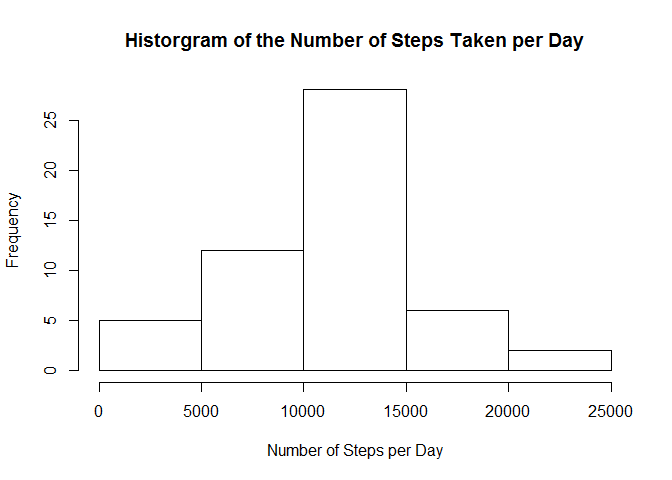

# Reproducible Research: Peer Assessment 1

## Loading and preprocessing the data


1. Load the data

```r
dat<-read.csv("activity.csv")
```

2. Process/transform the data (if necessary) into a format suitable for your analysis


```r
aggdat<-aggregate(steps~date, dat, sum,na.rm = TRUE)
```

## What is mean total number of steps taken per day?

Creating histogram of total steps taken each day

```r
hist(aggdat$steps,xlab = "Number of Steps per Day", main = "Historgram of the Number of Steps Taken per Day")
```

 

The mean of the total number of steps taken per day

```r
mean(aggdat$steps)
```

```
## [1] 10766.19
```

the median of the total number of steps taken per day

```r
median(aggdat$steps)
```

```
## [1] 10765
```

## What is the average daily activity pattern?


Aggregating the data to a usable format, plotting average number of steps taken, averaged across all days

```r
aggdat2<-aggregate(steps~interval,dat,mean,na.rm = TRUE)
plot(aggdat2$interval,aggdat2$steps,type = "l")
```

 

The following interval contains the maximum number of average steps

```r
aggdat2[aggdat2$steps==max(aggdat2$steps),]$interval
```

```
## [1] 835
```

## Imputing missing values

the folowing is the total number of missing values

```r
sum(is.na(dat$steps))
```

```
## [1] 2304
```

To fill in missing values, i have decided to replace the missing value with the average of all other values for that interval

Creating new dataset in variable newdat

```r
newdat<-dat#sets data to a new variable so old data is not changed
boollist<-is.na(newdat$steps)#gets a list of variables where there is a NA
temp<-cbind(as.numeric(row.names(newdat[boollist,])),newdat[boollist,]$interval)#creates a matrix of the index location and the interval value for each missing step vaule

for(i in 1:dim(temp)[1]){
    newdat[temp[i,1],]$steps<-aggdat2[aggdat2$interval == temp[i,2],]$steps#replaces data with average of that interval
}
```

Aggregating the data and creating a histogram of all the data with not NA's present in data

```r
newaggdat<-aggregate(steps~date, newdat, sum)
hist(newaggdat$steps,xlab = "Number of Steps per Day", main = "Historgram of the Number of Steps Taken per Day with NA's replaced")
```

 

The mean of the new complete dataset

```r
mean(newaggdat$steps)
```

```
## [1] 10766.19
```

the medium of the new complete dataset

```r
median(newaggdat$steps)
```

```
## [1] 10766.19
```
the mean and median appear to be fairly similar as to the data before NA's were removed

## Are there differences in activity patterns between weekdays and weekends?


creates a new factor varaible with the two levels == "weekday" and "weekend"

```r
newdat$date<-as.Date(newdat$date)#makes the date column to date data type
newdat1<-cbind(newdat,weekdays(newdat$date))#bind a new column of each day of the week to the data i.e "MOnday","Tuesday"....
colnames(newdat1)[4]<-"day" #Change column name to "day"
newdat1$day<-as.character(newdat1$day)#changes datatype to character so it can be manipulated 
for(i in 1:dim(newdat1)[1]){
    days<-newdat1$day[i]#takes the day for each record and checks if it is a weekday or weekend
    if (days == "Saturday" | days == "Sunday"){
        newdat1$day[i]<-"weekend"
    }else{
        newdat1$day[i]<-"weekday"
    }
   
}
newdat1$day<-as.factor(newdat1$day)#changes day column into a factor variable
```

Orgainizing data so it can be plotted as desired

```r
daydat <- newdat1[newdat1$day == "weekday",]#separte weekdays out to be manipulated
enddat <- newdat1[newdat1$day == "weekend",]#separate weekends out to be manipulated

aggday<-aggregate(steps~interval,daydat,mean)#aggregates weekday data
aggend<-aggregate(steps~interval,enddat,mean)#aggregates weekend data

#adds column designating type of day
aggday<-cbind(aggday,"weekday")
aggend<-cbind(aggend,"weekend")
#changes both column names to "day"
colnames(aggday)[3]<-"day"
colnames(aggend)[3]<-"day"
#row binds the data back togeter into one data set
aggtot<-rbind(aggday,aggend)
```

Plots the data in the panel plot requested

```r
library(lattice)
xyplot(steps~interval |day,data = aggtot, layout= c(1,2), main = "Average Steps for Intervals on Weekends and Weekdays")
```

 


It appears that activity on the weekend starts and stops later in the day, moves more throughout the day, but has a smaller maximum average
